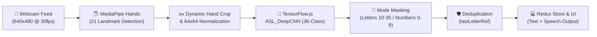

# 📑 Aashna (Sign Language Bridge) — Technical Status & Architecture Report

**Project Name:** Aashna (Sign Language Bridge)  
**Date:** August 27, 2026
**Architecture:** Client-Side Edge ML (MediaPipe + TensorFlow.js + React + Redux + Node/Express)

---

## 1. 🏗️ How the Project Currently Works

Aashna is a real-time Sign Language Recognition web application that converts American Sign Language (ASL) hand gestures into text and speech directly in the web browser.

### Key Technical Subsystems:

1. **Client-Side Hand Detection & Landmark Tracking**
   - Integrates `@mediapipe/hands` to detect up to 2 hands in real-time.
   - Extracts 21 3D coordinates per hand and calculates a tight bounding box around the hand with 10% padding.
   - Crops the bounding box from the raw camera frame onto an offscreen $64 \times 64$ HTML5 Canvas, normalizing pixel values to $[0, 1]$.

2. **Machine Learning Model (`ASL_DeepCNN`)**
   - **Architecture:** 4-Block Deep Convolutional Neural Network (Conv2D $\rightarrow$ BatchNorm $\rightarrow$ Conv2D $\rightarrow$ BatchNorm $\rightarrow$ MaxPool $\rightarrow$ Dropout) with 2.82 Million parameters.
   - **Classes:** 36 Unified Classes (`0–9` digits at indices 0–9, and `a–z` letters at indices 10–35).
   - **Accuracy:** Achieved **93.57% test accuracy** on held-out test data.
   - **Web Deployment:** Converted from native Keras `.keras` to Keras 2-compatible TensorFlow.js format (`model.json` + `group1-shard1of1.bin` [11.3 MB]) for client-side execution.

3. **Mode-Based Class Masking (`MODE_RANGE`)**
   - Restricts the argmax search space based on the active UI mode:
     - **Letters Mode (`A–Z`):** Only searches indices `10–35`.
     - **Numbers Mode (`0–9`):** Only searches indices `0–9`.
    - **Phrases Mode:** Uses the static letter classifier for Quiz, Spelling Bee, and Role Play letter challenges. It is not yet a dynamic phrase classifier.
   - Prevents digit-shaped hand poses from falsely triggering letter predictions (and vice versa).

4. **Intelligent Frame Deduplication (`lastLetterRef`)**
   - Solves the repetition problem (e.g., preventing `"AAAAAA"` output when holding a single sign).
   - Uses a non-rendering React `useRef` to track the last confirmed letter.
   - Only appends to the text string when a **new** letter is detected above the confidence threshold ($0.7$).
  - Letter predictions are normalized to uppercase before challenge comparisons.
  - Challenge text is cleared when starting or advancing a challenge to prevent stale input.

5. **Gamification and cloud progress**
  - Quiz, Spelling Bee, and Role Play update XP and progress locally.
  - Achievements refresh when local progress changes.
  - Leaderboard reads the top ten users from Firestore and displays Firebase errors with a retry state.
   - Automatically resets when the hand exits the camera frame or when the user switches mode.

---

## 2. 🎨 The Role of the Frontend

The frontend in Aashna is **not merely a user interface**—it acts as the **primary real-time AI execution engine**.

| Frontend Component | Primary Role & Function |
|---|---|
| **Real-Time ML Pipeline Host** | Loads and executes TensorFlow.js models directly on the client GPU/CPU using WebGL acceleration, eliminating network latency and protecting user video privacy. |
| **MediaPipe Visual Overlay** | Draws real-time 21-point hand skeletal tracking dots (`#2dd4bf` teal dots) onto the video canvas at 30 fps. |
| **High-Frequency State Management** | Uses `useRef` hooks to decouple 30 fps camera callback loops from React re-render cycles, preventing UI lag and render thrashing. |
| **Redux State Store (`predictionSlice`)** | Manages application-wide state including current prediction, confidence levels, accumulated text history, confidence thresholds, and active mode (`letters`, `numbers`, `phrases`). |
| **Accessibility & Output Suite** | Provides Text-To-Speech (TTS) synthesis, backspace/clear controls, and mode switching. |

---

## 3. 🚀 Remaining Requirements for a Fully Functional & Max-Accuracy System

To elevate Aashna from a static sign recognizer to a production-ready, maximum-accuracy Sign Language Bridge, the following components must be built:

### A. Dynamic Gesture Recognition (Sequence / Temporal Modeling)
- **Current Limitation:** Frame-by-frame static image classification cannot recognize moving signs (like the letters **'J'** or **'Z'**) or multi-word continuous sign language.
- **Solution Needed:** 
  - Build a 3D Landmark Sequence Pipeline that feeds a sequence of MediaPipe keypoint coordinates ($N$ frames $\times 21 \times 3$) into a lightweight **LSTM / GRU** or **Transformer** model.
  - Enables recognition of dynamic signs and fluid sentence formation.

### B. Implementation of "Phrases Mode"
- **Current Status:** Temporarily guarded (inference skipped).
- **Solution Needed:**
  - Collect dynamic landmark training data for high-frequency ASL phrases (*"Hello"*, *"Thank You"*, *"Yes"*, *"No"*, *"Please"*).
  - Train a dedicated sequence classifier and integrate it into `modelService.ts`.

### C. Advanced Environmental Generalization & Transfer Learning
- **Current Status:** Current CNN is trained on cropped 2D hand images ($64 \times 64$).
- **Solution Needed:**
  - Fine-tune a lightweight MobileNetV2 / EfficientNet backbone using domain-specific ASL datasets (e.g., ASL Citizen, WLASL) to improve performance across diverse lighting conditions, skin tones, and camera resolutions.
  - Implement automatic lighting normalization / contrast adjustments in the canvas preprocessing step.

### D. Full Backend Integration & Persistence
- **Current Status:** Express backend server exists with auth/route skeletons.
- **Solution Needed:**
  - Connect the React frontend to the Node/Express backend to save translation history, sync user accounts, store custom user vocabularies, and log model performance telemetry.

### E. Model Quantization & Web Performance Optimization
- **Current Status:** Unquantized float32 weight bundle ($11.3 \text{ MB}$).
- **Solution Needed:**
  - Quantize model weights to **INT8 / FP16**, reducing the web model size from $11.3 \text{ MB}$ to $\sim 2.8 \text{ MB}$.
  - This enables near-instant initial page loads on mobile devices and lower-end hardware.

---

## 📊 Summary Assessment Matrix

| Feature / Component | Status | Accuracy / Quality | Next Action |
|---|:---:|:---:|---|
| **Hand Tracking (MediaPipe)** | ✅ Functional | High (30 fps) | Add hand loss smoothing |
| **Static CNN Model (0-9 + A-Z)** | ✅ Functional | **93.57% Test Acc** | Quantize to INT8 |
| **Class Masking (Letters/Numbers)** | ✅ Functional | 100% Deterministic | Maintain per-mode bounds |
| **Deduplication (`lastLetterRef`)** | ✅ Functional | 100% Robust | Retain current implementation |
| **Challenge Modes** | ✅ Functional | Static letter recognition | Add temporal phrase model for dynamic signs |
| **Dynamic Signs ('J', 'Z')** | ⏳ Pending | N/A | Implement sequence buffer |
| **Quiz, Spelling Bee, Role Play** | ✅ Functional | Depends on model confidence and camera | Add browser interaction tests |
| **Badges** | ✅ Functional | Based on local progress | Move progress to shared reactive state |
| **Leaderboard** | 🔄 Firebase dependent | Requires auth, rules, and network | Configure production Firestore rules |
| **Backend Sync & Persistence** | 🔄 In Progress | Partial route skeleton | Connect REST API endpoints |
